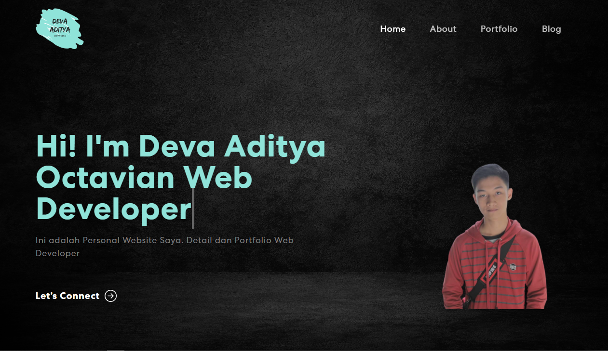

# TPA4 - Personal Website with React Js

## Deva Aditya Octavian - Front End Web Development

Saya membuat sebuah Aplikasi _**Personal Website with React Js**_ untuk memenuhi salah satu tugas Program Kampus Merdeka di Skilvul Tech For Impact yaitu tugas TPA-4 (Technical Project Assignment-4).

Berikut merupakan tampilan dari Aplikasi yang saya buat. Terima kasih.

Built using:

- Front-end library: React (CRA)
- CSS framework: React-bootstrap
- CSS animations library: Animate.css

Link Website : 
